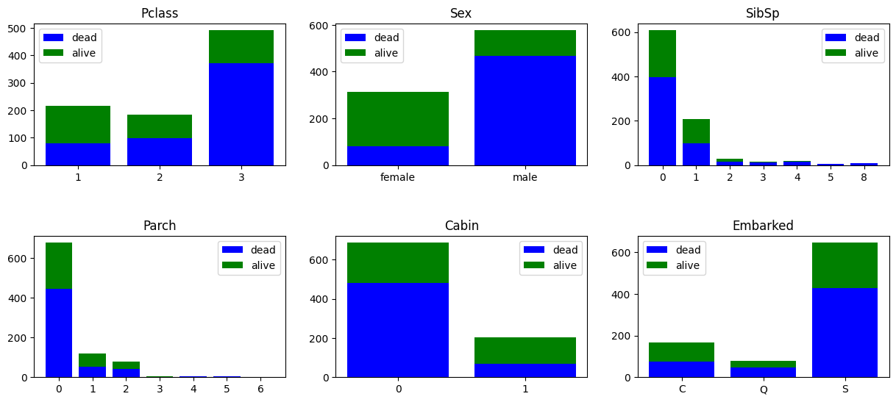
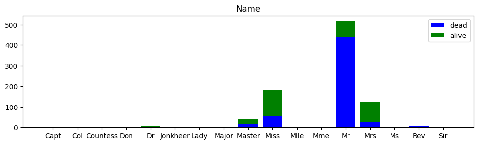
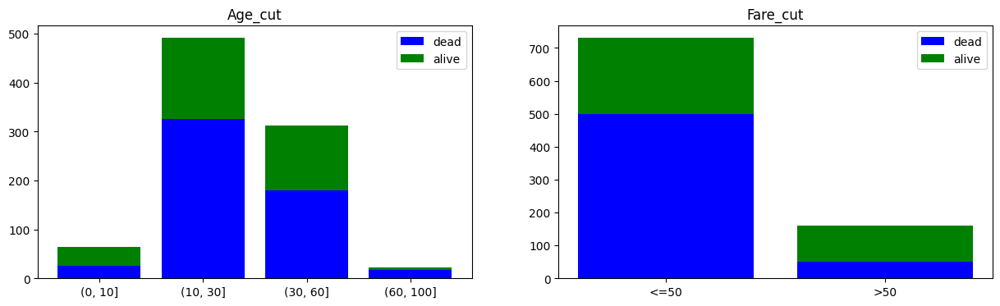
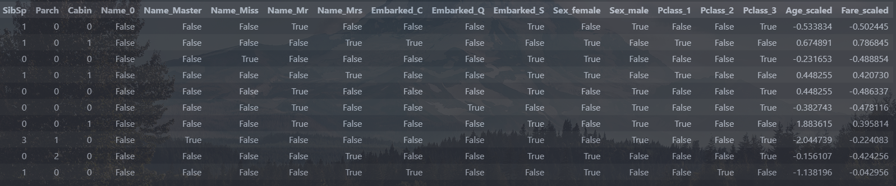
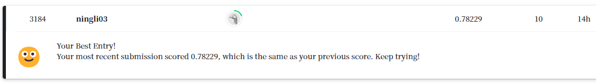
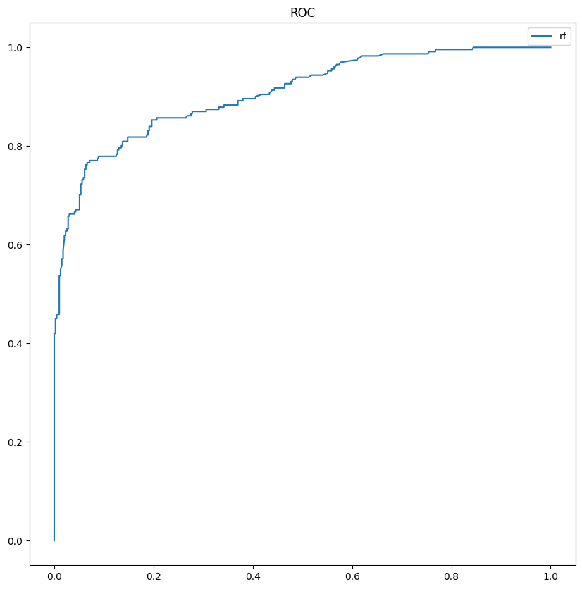
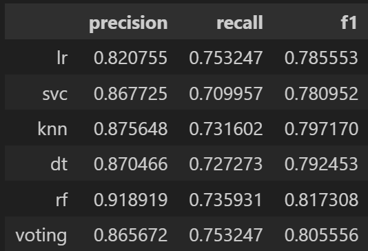
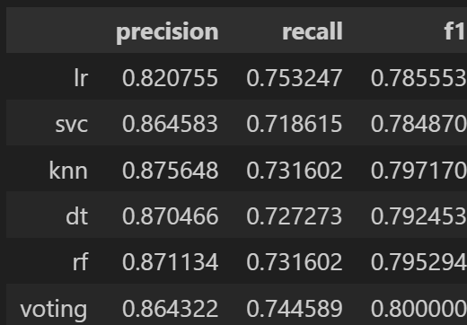
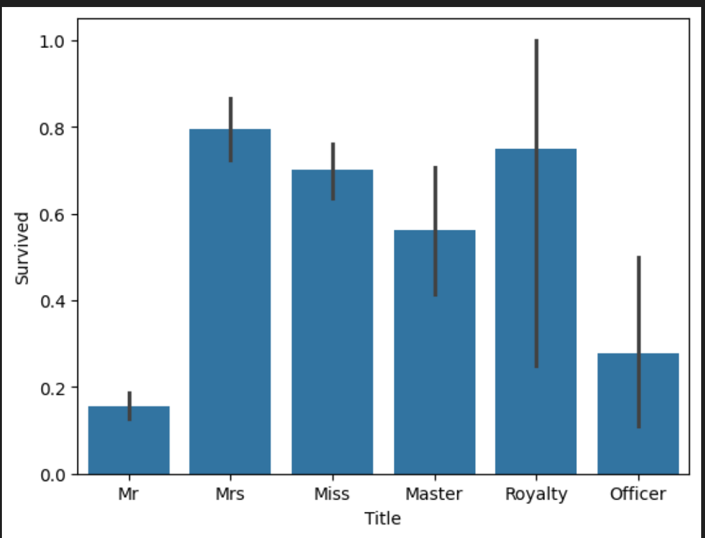
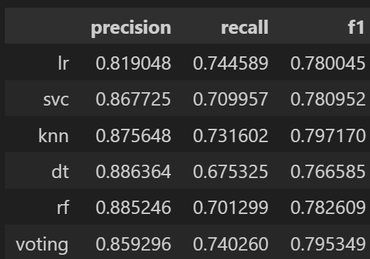

# 实践报告

## 项目介绍

项目地址：[泰坦尼克生存预测](https://github.com/baqiyansheng/Titanic)

...

## 人员分工

李宁：基础代码框架，包含数据预处理、可视化，随机森林模型构建、调参，模型评估。

江岩：优化数据预处理(`Age` 缺失值使用随机森林模型填充)，挖取新特征

TODO：优化数据预处理，包括 `Age` 缺失值使用随机森林模型填充（我是直接填的中位数），`Age` 和 `Fare` 离散化处理（我是直接按原数值标准化了），`Ticket` 项的利用（我直接剔除了），挖取新特征（这个最能提高准确率）等；补充模型类别，和模型评估（不用写，直接用我的？）

（参考 [Kaggle平台Titanic生存率预测项目(TOP3%) - 知乎 (zhihu.com)](https://zhuanlan.zhihu.com/p/50194676)）

报告撰写：每人负责自己的部分，其余部分为合作完成

## 任务流程

数据预处理

先预览一下数据，看数据集提供了多少特征，分别是代表什么，然后看各项有没有 `NaN` 的值。代码如下：

```python
# 数据加载
train = pd.read_csv("../data/train.csv")
test = pd.read_csv("../data/test.csv")
# 数据规模
print("train shape:", train.shape)
print("test shape:", test.shape)
# 数据预览
display(train.head(10))
display(train.isna().sum())
display(test.isna().sum())
```

#### 数据清洗

然后考虑什么数据可以删除、数据的缺失值用什么填充、能否通过提取某些数据让特征更鲜明。对于 `Embarked` 项，表示乘客登船的港口，一共只有三种可能取值，且只缺失了两个，因此直接用众数填充。对于 `Cabin` 项，缺失条目太多，而且特征取值格式不统一，考虑直接剔除，或者只保留代表是否缺失的二元取值（测试后发现保留二元取值效果略好），对于  `Ticket` 项，是独一无二的，直接剔除即可（后面发现存在多人用一张票的情况，可以优化代码）

对于 `Age` 项，缺失的条目较多，因此先计算其与其他项的相关程度，得出相关程度最大的是 `Pclass`，即船舱等级（很合理，富人一般不会太年轻）。那么将数据按 `Pclass` 分类，再取出在同一分类中的年龄中位数填充缺失值。对于 `Name` 项，为了简单起见，只保留称谓的特征，用正则匹配提取出称谓。（姓氏也可以作为特征，可以作为优化方向）

定义一个函数实现数据清洗，代码如下：

```python
def data_process(data):
    # 缺失的登船地点直接用众数填充
    data['Embarked'].fillna(data['Embarked'].mode()[0], inplace=True)
    # 统计年龄与其他数字项的相关程度
    # tmp = data[['PassengerId', 'Survived', 'Pclass', 'Age', 'SibSp', 'Parch', 'Fare']]
    # display(tmp.corr()['Age'].sort_values())
    # 计算各个 Pclass 的年龄中位数
    display(data.groupby('Pclass')['Age'].median())
    # 用各个 Pclass 的年龄中位数填充
    data['Age'].fillna(data.groupby('Pclass')['Age'].transform('median'), inplace=True)
    # # 船舱号缺失值过多，只考虑有无船舱号
    data['Cabin'].fillna(0, inplace=True)
    data.loc[data['Cabin'] != 0, 'Cabin'] = 1
    # 直接删除
    # train.drop(['Cabin'], axis=1, inplace=True)
    # 姓名，只保留称谓
    data['Name'] = data['Name'].str.extract(' ([A-Za-z]+)\.', expand=False)
    # Ticket 是独一无二的，直接删除
    data.drop(['Ticket'], axis=1, inplace=True)
    return data
```

#### 数据可视化

为了方便提取相关性高的特征，可以将每个特征值作为 x 轴，对应的总人数作为 y 轴（绿色代表存活的人数，蓝色代表未存活）画出堆叠直方图。对于非数值型的特征，比如 `Sex` ，需要先映射为数值型，再参与画图。

定义画图函数如下：

```python
# 画出特征与对应存活人数的堆叠柱状图
def plot_bar(feature, type=0):
    # 离散型特征
    if type == 0:
        # 横坐标为特征取值，可能是非数值型
        value = train[feature].unique()
        # 横坐标排序
        value.sort()
        y1 = []
        y2 = []
        for x_i in value:
            y1.append(train.loc[(train[feature] == x_i) & (train['Survived'] == 0)].shape[0])
            y2.append(train.loc[(train[feature] == x_i) & (train['Survived'] == 1)].shape[0])
        # 画图
        x = range(len(value))
        plt.bar(x, y1, color='b', label='dead')
        plt.bar(x, y2, bottom=y1, color='g', label='alive')
        # 设置横坐标刻度
        plt.xticks(x, value)
        plt.legend()
        plt.title(feature)
```

对于连续型的特征，比如 `Age` 和 `Fare` ，可以设置横坐标为区间，再画图。相关处理过程如下：

```python
# 年龄划分为四个区间：0~10为儿童；10~30为年轻人；30~60为中年人；60以上为老年人
# 新建一列 Age_cut，字符串类型
train['Age_cut'] = '(0, 10]'
# 将年龄划分为四个区间
train.loc[train['Age'] > 10, 'Age_cut'] = '(10, 30]'
train.loc[train['Age'] > 30, 'Age_cut'] = '(30, 60]'
train.loc[train['Age'] > 60, 'Age_cut'] = '(60, 100]'
# 画出年龄分布
plt.figure(figsize=(15, 10))
plt.subplots_adjust(hspace=0.5)
plt.subplot(2, 2, 1)
plot_bar('Age_cut')
# 票价每 50 为一个区间
train['Fare_cut'] = '<=50'
train.loc[train['Fare'] > 50, 'Fare_cut'] = '>50'
plt.subplot(2, 2, 2)
plot_bar('Fare_cut')
plt.show()
```

对每个特征值调用一次函数，可以画出图像结果如下：







### 模型构建

#### 特征工程

首先需要根据模型的输入要求修改特征，比如对于离散非数值型使用 `one-hot` 编码，对于数值型可能需要标准化处理。定义特征因子化和归一化函数如下：

```python
# 特征因子化, one-hot 编码
def set_numeralization(data):
    # 针对定类性属性进行因子化，分别有Embarked,Sex,Pclass
    dummies_Embarked = pd.get_dummies(data['Embarked'], prefix='Embarked')
    dummies_Sex = pd.get_dummies(data['Sex'], prefix='Sex')
    dummies_Pclass = pd.get_dummies(data['Pclass'], prefix='Pclass')
    # 将 Name 转为数值型，保留人数大于 10 的称谓
    name = data['Name'].value_counts()
    name = name[name > 10].index
    data.loc[~data['Name'].isin(name), 'Name'] = 0
    dummies_Name = pd.get_dummies(data['Name'], prefix='Name')
    # 将新的属性拼合
    df = pd.concat([data, dummies_Name, dummies_Embarked, dummies_Sex, dummies_Pclass], axis=1)
    # 将旧的属性剔除
    df.drop(['Name', 'Pclass', 'Sex', 'Embarked'], axis=1, inplace=True)
    return df

# 特征归一化
def set_normalization(df):
    scaler = preprocessing.StandardScaler()
    age_scale_param = scaler.fit(df['Age'].values.reshape(-1,1))
    df['Age_scaled'] = scaler.fit_transform(df['Age'].values.reshape(-1,1),age_scale_param)
    fare_scale_param = scaler.fit(df['Fare'].values.reshape(-1,1))
    df['Fare_scaled'] = scaler.fit_transform(df['Fare'].values.reshape(-1,1),fare_scale_param)
    df.drop(['Age', 'Fare'], axis=1, inplace=True)
    return df
```

修改后的特征如下表所示：



#### 模型训练

先将训练集分出一部分作为验证集，使用 `train_test_split` 函数 。这里以随机森林模型为例，直接从 `sklearn` 库中调用即可。代码如下：

```python
# 随机森林模型
from sklearn.ensemble import RandomForestClassifier
rf = RandomForestClassifier()
# 训练模型
rf.fit(x_train, y_train)
# 模型得分
print("Accuracy:", rf.score(x_test, y_test))
# 预测
y_test = rf.predict(x_exam)
result = pd.DataFrame({'PassengerId': test['PassengerId'], 'Survived': y_test})
# 结果写入文件
result.to_csv("../result/rf_predict.csv", index=False)
```

得分：0.7836

#### 模型调优

使用网格搜索找出最适合的模型参数，由于逐个调时间太长，所以使用 `RandomiedSearchCV`，加快调参速度。相关代码如下：

```python
# 调参 n_estimators, max_depth, min_samples_split, min_samples_leaf
# 使用 RandomizedSearchCV, 速度更快
from sklearn.model_selection import RandomizedSearchCV
# 参数范围
param_grid = {'n_estimators': np.arange(10, 100), 'max_depth': np.arange(1, 10), 'min_samples_split': np.arange(2, 10), 'min_samples_leaf': np.arange(1, 10)}
grid = RandomizedSearchCV(RandomForestClassifier(), param_grid, cv=5)
grid.fit(x_train, y_train)
print(grid.best_params_)
rf_best = grid.best_estimator_
# 模型得分
print("Accuracy:", rf_best.score(x_test, y_test))
# 预测
y_exam = rf_best.predict(x_exam)
# 保存结果
result = pd.DataFrame({'PassengerId': test['PassengerId'], 'Survived': y_exam})
result.to_csv("../result/rf_best_predict.csv", index=False)
```

得分 0.8134

可以看到，调参后模型表现提升。将预测结果上传 `Kaggle` 网站上，得分 `0.78229`，排名 `3184`，还有比较大的优化空间。



### 模型评估

##### 交叉验证

使用 `cross_val_score` 函数即可，代码如下：

```python
# 随机森林
rf_cv = cross_val_score(rf_best, x_train, y_train, cv=5)
print("rf_cv:", rf_cv.mean())
```

得分：08234

##### 混淆矩阵

使用 `confusion_matrix` 函数，代码如下：

```python
# 随机森林
rf_cm = confusion_matrix(y_train, rf_best.predict(x_train))
rf_precision = rf_cm[1, 1] / (rf_cm[0, 1] + rf_cm[1, 1])
rf_recall = rf_cm[1, 1] / (rf_cm[1, 0] + rf_cm[1, 1])
rf_f1 = 2 * rf_precision * rf_recall / (rf_precision + rf_recall)
```

得分分别为：0.8808， 0.7359， 0.8019

##### ROC 曲线

使用 `roc_curve` 函数，代码如下：

```python
# 随机森林
rf_fpr, rf_tpr, rf_thresholds = roc_curve(y_train, rf_best.predict_proba(x_train)[:, 1])
# 画出 ROC 曲线
plt.figure(figsize=(10, 10))
plt.title('ROC')
plt.plot(rf_fpr, rf_tpr, label='rf')
plt.legend()
plt.show()
```

结果如下图：



### 数据再调整

#### 离散化数据与ticket项的利用

在初步完成基础代码后，再对数据做进一步的调整，例如离散化数据减少噪声，对ticket项进行利用等

修改部分代码如下：

```python
# Ticket 是独一无二的，直接删除
#data.drop(['Ticket'], axis=1, inplace=True)

#用 -1 填充 Ticket
data['Ticket'].fillna(-1, inplace=True)
return data
```

```python
def set_planarization(data):
    #离散化 Age Fare
    #使用pd中的cut离散化
    #data['Age'] = pd.cut(data['Age'], bins=4, labels=[1, 2, 3, 4])
    #data['Fare'] = pd.cut(data['Fare'], bins=2, labels=[1, 2])
    #手动离散化
    for i in range(0,data['Age'].size):
        if (0 < data.loc[i,'Age'] and data.loc[i,'Age'] <= 10):
            data.loc[i,'Age'] = 1
        if (10 < data.loc[i,'Age'] and data.loc[i,'Age'] <= 30):
            data.loc[i,'Age'] = 2
        if (30 < data.loc[i,'Age'] and data.loc[i,'Age'] <= 60):
            data.loc[i,'Age'] = 3
        if (60 < data.loc[i,'Age'] and data.loc[i,'Age'] <= 100):
            data.loc[i,'Age'] = 4
    for i in range(0,data['Fare'].size):
        if (data.loc[i,'Fare'] <= 50):
            data.loc[i,'Fare'] = 1
        if (data.loc[i,'Fare'] > 50):
            data.loc[i,'Fare'] = 2
    #处理ticket 同一张ticket被多个人使用，则他们在船上有同伴，赋值为1，否则赋值为0
    #使用pd里的duplicated查重复值
    #data['Companion'] = data.duplicated(subset='Ticket', keep=False).astype(int)
    #手动
    for i in range(0,data['Ticket'].size):
        flag = 0
        #-1表示缺失
        if data.loc[i,'Ticket'] == -1:
            data.loc[i,'Ticket'] = 0
            continue
        if data.loc[i,'Ticket'] != 1:
            for j in range(i + 1,data['Ticket'].size):
                if (data.loc[i,'Ticket'] == data.loc[j,'Ticket']):
                    flag = 1
                    data.loc[j,'Ticket'] = flag
        data.loc[i,'Ticket'] = flag
    return data
```

#### 随机森林预测模型填充Age缺失值

根据算的年龄和其他特征的相关性，发现Age和Pclass, SibSp, Parch相关系数较高，因此利用这三个特征和随机森林模型，对年龄的缺失值进行预测。

```python
def fill_age(data):
    # 将数据集划分为有缺失值和无缺失值的两部分
    data_with_age = data.dropna(subset=['Age'])
    data_without_age = data[data['Age'].isnull()]
    # 将数据集划分为有缺失值和无缺失值的两部分
    data_with_age = data.dropna(subset=['Age'])
    data_without_age = data[data['Age'].isnull()]

    # 定义特征和目标变量。根据前面获取的其他特征与Age的相关性，只选择Pclass、SibSp、Parch这三个特征作为训练模型的特征。
    features = ['Pclass', 'SibSp', 'Parch']
    target = 'Age'


    # 创建训练集和测试集
    X_train = data_with_age[features]
    y_train = data_with_age[target]
    X_test = data_without_age[features]

    # 初始化随机森林回归模型
    rf_model = RandomForestRegressor()

    # 训练模型
    rf_model.fit(X_train, y_train)

    # 预测缺失值
    predicted_age = rf_model.predict(X_test)

    # 填充缺失值
    data.loc[data['Age'].isnull(), 'Age'] = predicted_age
    # return data
```

运行结果对比如下：

|          | 模型融合准确率     | 交叉验证lr         | svc                | knn                | dt                 | rf                 | voting             |
| -------- | ------------------ | ------------------ | ------------------ | ------------------ | ------------------ | ------------------ | ------------------ |
| 中位数   | 0.8134328358208955 | 0.8394451612903225 | 0.8298451612903227 | 0.8121677419354839 | 0.8298967741935485 | 0.8426709677419355 | 0.8330322580645163 |
| 随机森林 | 0.8097014925373134 | 0.8378451612903225 | 0.8282451612903227 | 0.8121806451612903 | 0.8314838709677421 | 0.8330709677419355 | 0.8314451612903225 |

中位数填充混淆矩阵结果如下：



随机森林预测填充混淆矩阵结果如下：



可以看到，中位数填充和随机森林预测填充的效果差异并不显著。可能是其他特征和Age属性的相关性不够强导致的。

#### 挖取新特征Title

旅客姓名数据中包含头衔信息，不同头衔也可以反映旅客的身份，而不同身份的旅客其生存率有可能会出现较大差异。因此我们通过Name特征提取旅客头衔Title信息，并分析Title与Survived之间的关系。

```python
def add_title(full):
    #构造新特征Title
    full['Title']=full['Name'].map(lambda x:x.split(',')[1].split('.')[0].strip())
    #查看title数据分布
    # display(full['Title'].value_counts())
    # display(full)

    #将title信息进行整合
    TitleDict = {}
    TitleDict['Mr'] = 'Mr'
    TitleDict['Mlle'] = 'Miss'
    TitleDict['Miss'] = 'Miss'
    TitleDict['Master'] = 'Master'
    TitleDict['Jonkheer'] = 'Master'
    TitleDict['Mme'] = 'Mrs'
    TitleDict['Ms'] = 'Mrs'
    TitleDict['Mrs'] = 'Mrs'
    TitleDict['Don'] = 'Royalty'
    TitleDict['Sir'] = 'Royalty'
    TitleDict['the Countess'] = 'Royalty'
    TitleDict['Dona'] = 'Royalty'
    TitleDict['Lady'] = 'Royalty'
    TitleDict['Capt'] = 'Officer'
    TitleDict['Col'] = 'Officer'
    TitleDict['Major'] = 'Officer'
    TitleDict['Dr'] = 'Officer'
    TitleDict['Rev'] = 'Officer'

    full['Title'] = full['Title'].map(TitleDict)
    # display(full['Title'].value_counts())
    sns.barplot(data=full, x='Title', y='Survived')
```



可以看到，Mr，Officer存活率较低，可能因为他们阶级较低，且女士优先

下面利用Title属性训练模型，得到下面的对比结果：

|       | 模型融合准确率     | 交叉验证lr         | svc                | knn                | dt                 | rf                 | voting             |
| ----- | ------------------ | ------------------ | ------------------ | ------------------ | ------------------ | ------------------ | ------------------ |
| Name  | 0.8134328358208955 | 0.8394451612903225 | 0.8298451612903227 | 0.8121677419354839 | 0.8298967741935485 | 0.8426709677419355 | 0.8330322580645163 |
| Title | 0.8134328358208955 | 0.8394451612903225 | 0.8298322580645163 | 0.8105548387096775 | 0.8363096774193549 | 0.8202193548387097 | 0.8330193548387097 |

除dt模型外，其余模型的准确率都有一定程度下降



## 总结与收获

由于我们组三个人都没有数据分析基础，所以选了 `Titanic` 这个入门级的简单题目。整个过程实践下来学到了很多，除了数据采集和存储部分题目给好了（这一部分在 `Web 信息处理与应用` 这门课得到了实践），基本上完整的体验了数据分析的全流程，也熟悉了 `python` 机器学习相关库的使用，收获颇丰。
